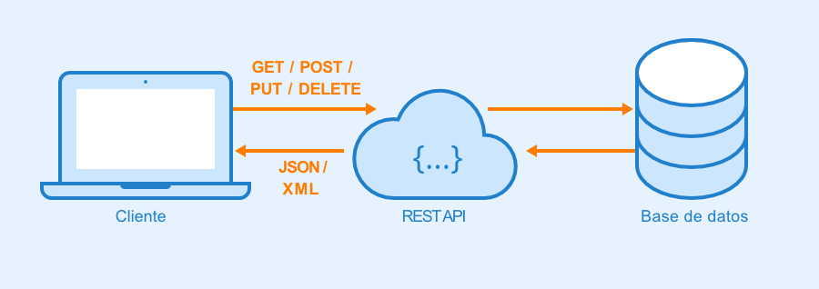

<h1 align="center"> simulacion de servidor en java </h1>

## índice
* [main](#main)
* [service](#service)
* [controller](#controller)
* [model](#model)

## introducción
proyecto desarrollado como trabajo final de la clase leguajes de programación del pregrado en ingenieria de sistemas. Api-rest simula un servidor donde se le pueden hacer peticiones CRUD para trabajar con una base de datos, todo en un entorno local.

## funcionalidades del proyecto
* ### leer usuarios en la base de datos 
<ul></ul>

* ### buscar usuario con id 
<ul></ul>

* ### crear usuario 
<ul></ul>

* ### editar información de usuario con id 
<ul></ul>

* ### eliminar un usuario 
<ul></ul>

* ### detener ejecución 
<ul></ul>

## main
<ul>la clase main es la clase principal, tiene 4 metodos</ul>

### metodos
* #### validarUrl
el metodo validarUrl es un metodo booleano su función es asegurarse de que las urls recibidas sean correctas, para realizar esta función recibe un strign que será la url y luego lo divide

	ejemplo de entrada: http://localhost:8080/api/users
el string de entrada se divide en tres partes, usando los dos puntos como criterio de divición(":") y guarda el resultado en "DatosArr[]", después divide los datos que quedaron en la tercera celda del array, esta vez su criterio de división es ("/") 
	
	DatosArr en posicion 2: 8080/api/users
ahora pasamos a evaluar si el contenido de las celdas coincide con una entrada valida, para hacer la comparación se usa equals, que regresa verdadero si los elementos comparados son iguales y falso si son diferentes, en caso de que algun dato no sea igual al que deberia entrar entonces retorna falso,en cambio, si la entrada es correcta imprime el mensaje "url validada correctamente" y retorna verdadero

* #### menu
El metodo menú es void y lo unico que hace es imprimir el menú, que consiste en 6 opciones
1. leer usuarios
2. encontrar un usuario
3. crear un usuario
4. editar información de un usuario
5. eliminar usuario
6. salir

* #### elegir
el metodo elegir es un metodo de tipo booleano y un menú interactivo, que según lo que ingreses hace una cosa u otra, está hecho alrededor de un switch que recibe las opciones del 1 al 6 ofrecidas por el metodo menú y según la opción elegida le manda una petición al servidor, como una de las opciones es salir, retorna falso en la opcion 6 y verdadero de no entrar en ella, esto se usa en el metodo main para salir del while que ejecuta el programa 
* #### main
el metodo main tiene la variable ejecucion de tipo booleano que inicia verdadera y sirve manterner ejecutando el programa hasta que el usuario ingrese la opcion 6 que es salir, 
el while que está en el main recibe como parametro a la variable ejecucion, en caso de que ejecucion sea verdadera se llama a los metodos menu y elegir

para no tener una lista de usurios vacia al inicio se envian tres peticiones al servidor antes de abrir el menú, donde se crean 3 nuevos usuarios  
## service
<ul><h3> JPAUsers </h3></ul>

<ul>
  Interfaz que pertenece al paquete service y contiene los métodos abtractos(CRUD) que se implementan en la clase JPAUsersImpl
</ul>
<ul><h3> JPAUsersImpl </h3></ul>

la clase JPAUsersImpl pertenece al paquete Service e implementa los metodos CRUD del sistema
  + #### create
  	es un metodo de tipo void que obtiene los datos ingresados, los divide, los guarda en un nuevo objeto de tipo usuario y los agrega a la lista de usaurios
  + #### UpdateById 
  	es un metodo de tipo void que recibe un numero de identificacion(Id) el cual va a buscar en la lista de usuarios hasta encontrar un usuario con id igual a el ingresado, si lo encuentra pide mas datos, para poder reemplazar los datos "viejos" por los que recibirá, todo separado por comas 
			
			Ejemplo: juan,juanito@gmail.com,3024042021
	tambien valida si se ingresaron mas o menos datos de los necesarios, si se ingresaron una cantidad erronea de datos (la correcta es 3) no se hace el cambio y se imprime un mensaje de error, si se ingresó la cantidad correcta de datos se hace el cambio y se imprimen los nuevos datos del usuario en formato de tabla, en caso de no encontrarse el usuario no se hace nada.
  + #### deleteById 
  	es un metodo de tipo void que recibe un numero de identificacion(Id) el cual va a buscar en la lista de usuarios hasta encontrar un usuario con id igual a el ingresado, si lo encuentra entonces la variable booleana "encontrado" que al inicio es falsa se vuelve verdadera y se elimina el usuario de la lista de usuarios, si no encontramos en usuario, o lo que es lo mismo, al finalizar el metodo la variable "encontrado" sigue siendo falsa como al inicio se lanza un mensaje de error "No se ha encontrado el usuario con id "+ la id del usuario
  + #### findById 
	tambien es void y recibe un Id, el cual usa para encontrar un usaurio en la lista de usuarios y luego imprimirlo
  + #### printUsers 
	imprime todos los usuarios en la lista de usuarios y les da un formato de tipo tabla
	
	| nombre | email        | numero    |
	|--------|--------------|-----------|
	| pepe   | p@gmail.com  | 3024566767|
	| sofia  | sof@gmail.com| 3051234509|

  
## controller
<ul><h3> server </h3></ul>
<ul>
la clase server pertenece al paquete controller y es la que simula el funcionamiento del servidor, tiene en sus atributos de tipo string los siguientes: method, url, versionprotocol, headers, body y de tipo int tiene el Id. sus metodos en general llaman a una función de la clase JPAimpl y dan una respuesta del servidor, los metodos de la clase son:
</ul> 

* #### getUsersById
	obtiene e imprime todos los usuarios ademas de la respuesta del servidor 
* #### getUsersById
	obtiene e imprime un solo usuario(si es encontrado) y la respuesta del servidor
* #### PostUser
	crea un nuevo usuario e imprime la respuesta del servidor
* #### DeleteById
	eliminar usuario segun su numero de identificacion e imprime la respuesta del servidor
* #### PutUserById
	cambia los datos de un usuario si el numero recibido coincide con su numero de identificacion e imprime la respuesta del servidor
* #### toString
	metodo para mostrar la representacion en string del objeto 
## customer
<ul><h3> ClienteHTTP</h3></ul>
<ul> pertenece al paquete customer y contiene cuatro atributos tipo String: "url", "headers","method","body"</ul>

## model
<ul><h3> User</h3></ul>  
<ul>  la clase usuario pertenece al paquete model y sirve para manejar los datos de los usuarios que se ingresan al sistema, dentro de ella se encuentran los atributos, metodos y el constructor de la clase.
los metodos se constituyen casi completamente de getters y setters de los atributos de la clase, ademas de un toString que sirve para mostrar la representacion en string del objeto. </ul>
