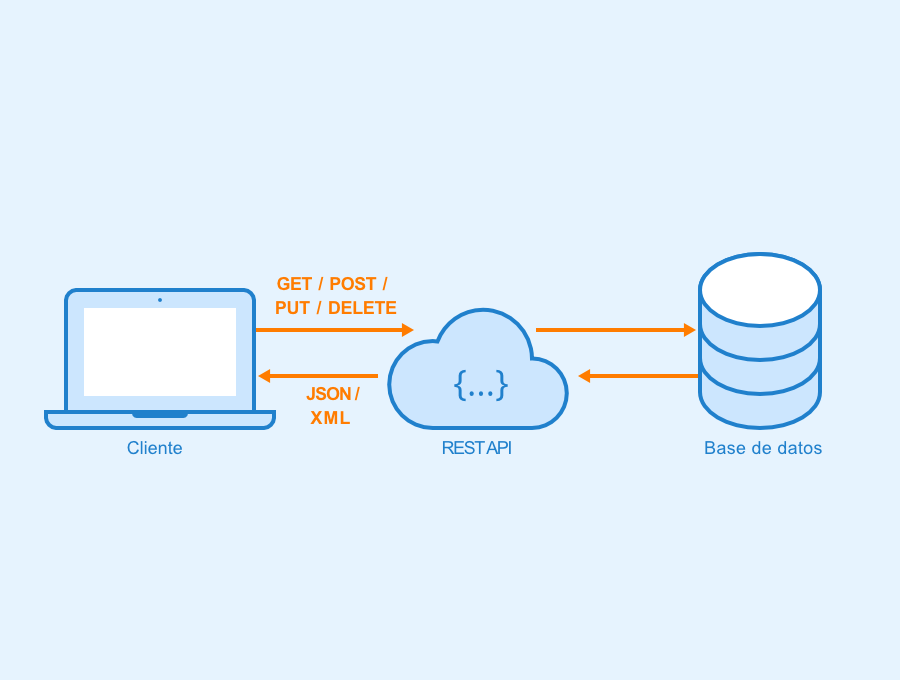
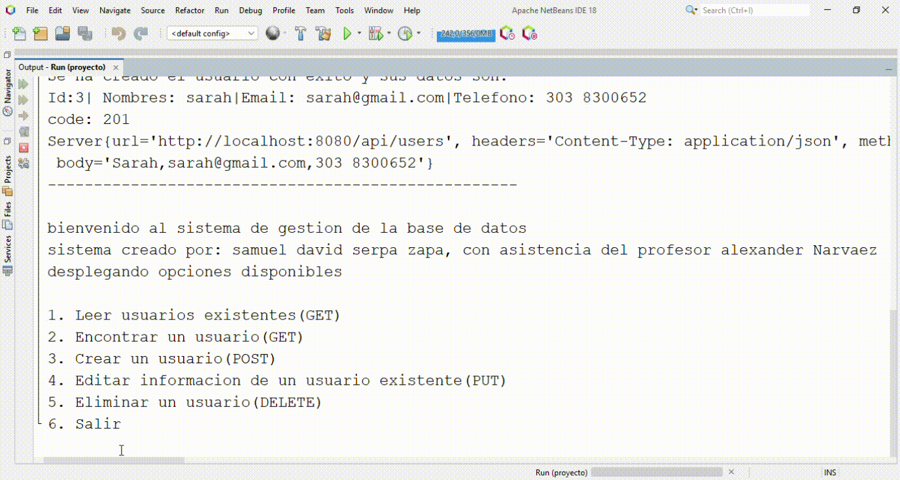
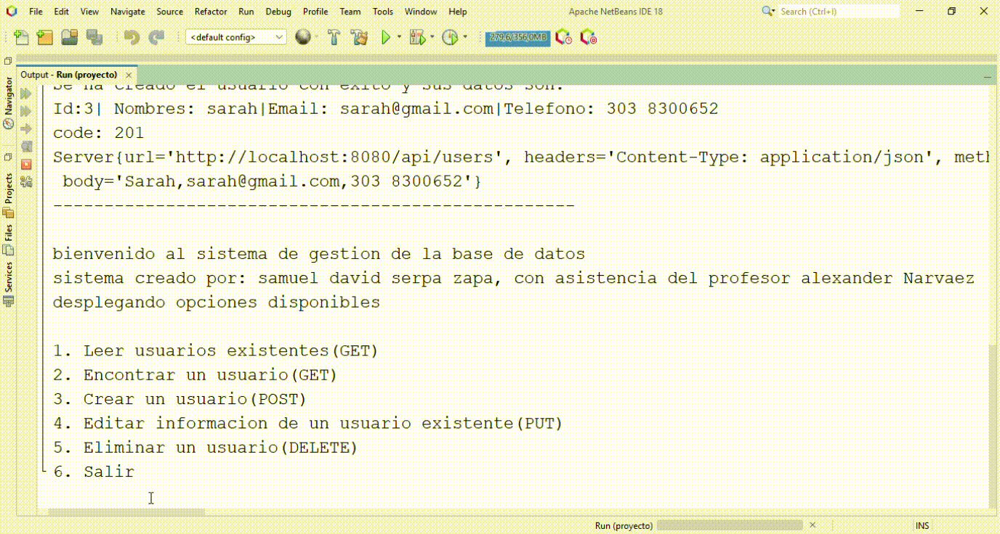
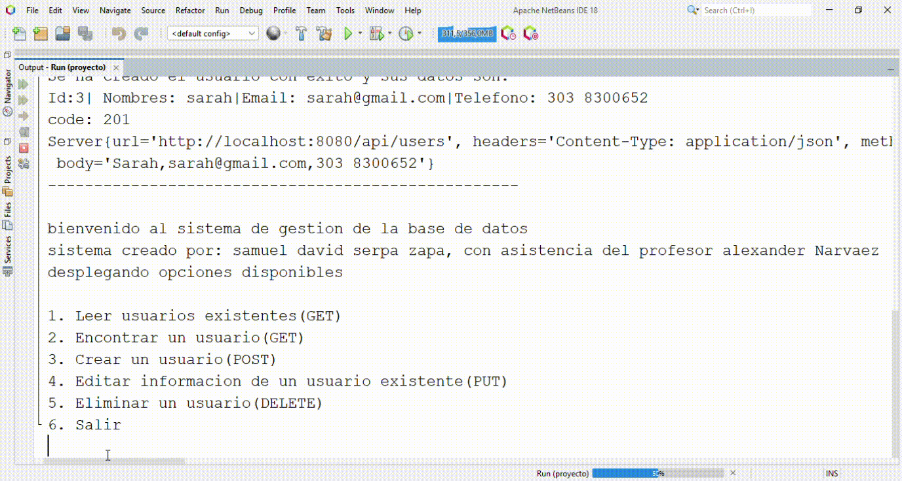

<h1 align="center"> simulacion de servidor en java </h1>

## índice
* [main](#main)
* [service](#service)
* [controller](#controller)
* [model](#model)

## introducción
proyecto desarrollado como trabajo final de la clase leguajes de programación del pregrado en ingenieria de sistemas. Api-rest simula un servidor donde se le pueden hacer peticiones CRUD para trabajar con una base de datos, todo en un entorno local.

### funcionalidades del proyecto
* leer usuarios en la base de datos 
* buscar usuario con id 
* crear usuario 
* editar información de usuario con id 
* eliminar un usuario 
* detener ejecución 

## main

## service

## controller

## customer

## model
